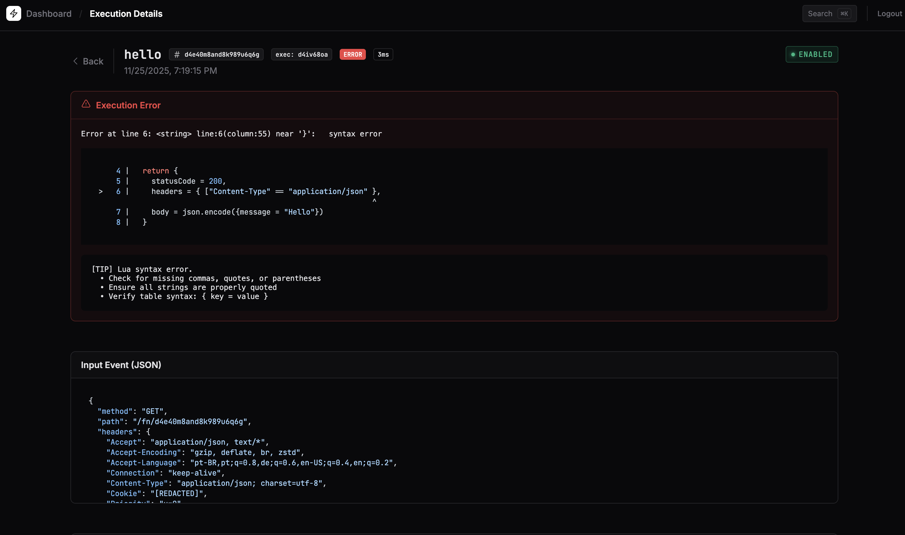
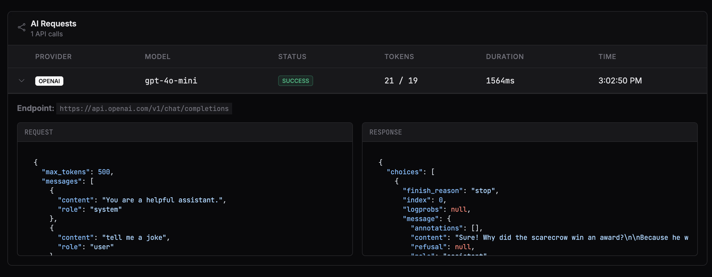

# FaaS-Go (temporary name)

A lightweight, self-hosted Function-as-a-Service platform written in Go with Lua scripting.

> **Beta Phase Notice**: This project is currently in beta. New features and changes are actively being developed, but I promise to maintain backward compatibility for all Lua APIs. 

## Features

* **Simple Lua Functions** - Write serverless functions in Lua
* **Code Editor** - Monaco Editor with autocomplete and inline documentation
* **HTTP Triggers** - Execute functions via HTTP requests
* **Built-in APIs** - HTTP client, KV store, environment variables, logging, and more
* **AI Integration** - Chat completions with OpenAI and Anthropic, with request/response logging
* **Email Integration** - Send emails via Resend with scheduling support
* **Version Control** - Track and manage function versions
* **Execution History** - Monitor function executions and logs
* **Beautiful Error Messages** - Human-friendly error messages with code context, line numbers, and actionable suggestions
* **Web Dashboard** - Manage functions through a clean web interface
* **Lightweight** - Single binary, no external dependencies

## Screenshots

### Dashboard


### Function Editor


### Environment Variables


### Testing Functions


### Execution History


### Version Management


### Version Comparison


### Command Palette


### Error Messages


### AI Request Logs


## Quick Start

### Building from Source

```bash
git clone https://github.com/dimiro1/faas-go.git
cd faas-go
make build
```

### Running

```bash
./faas-go
```

The API will be available at `http://localhost:3000` and the dashboard at `http://localhost:3000/`.

### First-Time Setup

On first run, FaaS-Go will automatically generate an API key and save it to `data/api_key.txt`. The key will be printed in the server logs:

```
INFO Generated new API key key=cf31cb0cdc7811ca9cec6a3c77579b3ea28c1e4e10d6fc1061ae71788834c21b file=data/api_key.txt
```

When you access the dashboard, you'll be prompted to enter this API key to login. The key is also available in the `data/api_key.txt` file.

## Writing Functions

Functions are written in Lua and must export a `handler` function:

```lua
function handler(ctx, event)
  -- ctx contains execution context (executionId, functionId, etc.)
  -- event contains HTTP request data (method, path, query, body, headers)
  
  log.info("Function started")
  
  return {
    statusCode = 200,
    headers = { ["Content-Type"] = "application/json" },
    body = json.encode({ message = "Hello, World!" })
  }
end
```

### Available APIs

* **log** - Logging utilities (info, debug, warn, error)
* **kv** - Key-value storage (get, set, delete)
* **env** - Environment variables (get)
* **http** - HTTP client (get, post, put, delete)
* **json** - JSON encoding/decoding
* **crypto** - Cryptographic functions (md5, sha256, hmac, uuid)
* **time** - Time utilities (now, format, sleep)
* **url** - URL utilities (parse, encode, decode)
* **strings** - String manipulation
* **random** - Random generators
* **base64** - Base64 encoding/decoding
* **ai** - AI chat completions (OpenAI, Anthropic)
* **email** - Send emails via Resend

### Example: Counter Function

```lua
function handler(ctx, event)
  -- Get current count from KV store
  local count = kv.get("counter") or "0"
  local newCount = tonumber(count) + 1
  
  -- Save updated count
  kv.set("counter", tostring(newCount))
  
  log.info("Counter incremented to: " .. newCount)
  
  return {
    statusCode = 200,
    headers = { ["Content-Type"] = "application/json" },
    body = json.encode({ count = newCount })
  }
end
```

### Example: Send Email

```lua
-- Requires RESEND_API_KEY environment variable
function handler(ctx, event)
  local data = json.decode(event.body)

  local result, err = email.send({
    from = "noreply@yourdomain.com",
    to = data.email,
    subject = "Welcome!",
    html = "<h1>Hello, " .. data.name .. "!</h1>",
    scheduled_at = time.now() + 3600  -- Optional: send in 1 hour
  })

  if err then
    return {
      statusCode = 500,
      body = json.encode({ error = err })
    }
  end

  return {
    statusCode = 200,
    headers = { ["Content-Type"] = "application/json" },
    body = json.encode({ email_id = result.id })
  }
end
```

### Calling Functions

```bash
curl -X GET http://localhost:3000/fn/{function-id}
curl -X POST http://localhost:3000/fn/{function-id} -d '{"key":"value"}'
curl -X GET http://localhost:3000/fn/{function-id}?name=John
```

## Deployment

### Docker

```bash
# Build and run with Docker
docker build -t faas-go .
docker run -p 3000:3000 -v faas-data:/app/data faas-go

# Or use Docker Compose
docker compose up -d
```

### Railway

FaaS-Go is ready to deploy on [Railway](https://railway.app):

1. **Connect Repository** - Link your GitHub repository to Railway
2. **Add Volume** - Create a volume and mount it to `/data`
3. **Set Environment Variables**:
   - `BASE_URL` - Your Railway public URL (e.g., `https://yourapp.up.railway.app`)
   - `API_KEY` - (Optional) Set a custom API key, or let it auto-generate
4. **Deploy** - Railway will automatically detect the Dockerfile and deploy

The Dockerfile is Railway-compatible and will:
- Use Railway's automatic `PORT` environment variable
- Bind to `0.0.0.0:$PORT` for public networking
- Persist data to the mounted volume at `/data`

## Configuration

FaaS-Go can be configured via environment variables:

```bash
PORT=3000                 # HTTP server port (default: 3000)
DATA_DIR=./data           # Data directory for SQLite database (default: ./data)
EXECUTION_TIMEOUT=300     # Function execution timeout in seconds (default: 300)
API_KEY=your-key-here     # API key for authentication (auto-generated if not set)
BASE_URL=http://localhost:3000  # Base URL for the deployment (auto-detected if not set)
```

### Authentication

The dashboard requires authentication via API key. You can:

1. **Auto-generate** (recommended) - Let FaaS-Go generate a secure key on first run
2. **Set manually** - Provide your own key via the `API_KEY` environment variable

API calls can authenticate using either:
- **Cookie** - Automatically handled by the dashboard after login
- **Bearer token** - Include `Authorization: Bearer YOUR_API_KEY` header

Example API call with Bearer token:
```bash
curl -H "Authorization: Bearer YOUR_API_KEY" http://localhost:3000/api/functions
```

Note: Function execution endpoints (`/fn/{id}`) do not require authentication.

## Testing

### Go Tests

Run the Go unit tests:

```bash
make test
```

### Frontend Tests (Jasmine)

The frontend uses [Jasmine](https://jasmine.github.io/) for unit testing, running directly in the browser without Node.js dependencies.

```bash
make test-frontend
```

This starts a local Go server and opens the test runner at `http://localhost:8888/test/SpecRunner.html`. Tests cover:

- Route URL generators
- UI components (Button, Badge, Table, Pagination, ...)

### E2E Tests (chromedp)

End-to-end tests use [chromedp](https://github.com/chromedp/chromedp) to run a headless Chrome browser:

```bash
make test-e2e
```

E2E tests cover:

- Login flow
- Page navigation
- Functions list rendering

### Run All Tests

```bash
make test-all
```

This runs Go unit tests and E2E tests. Run `make test-frontend` separately to open the browser-based Jasmine tests.

## Architecture

* **Backend** - Go with standard library HTTP server, SQLite database
* **Frontend** - Mithril.js SPA with Monaco Editor
* **Runtime** - GopherLua for Lua script execution
* **Storage** - SQLite for functions, versions, executions, KV store, and environment variables

## Contributing

Contributions are welcome! Please feel free to submit issues or pull requests.

## Author

Claudemiro Alves Feitosa Neto

## License

MIT License - see [LICENSE](LICENSE) file for details.
