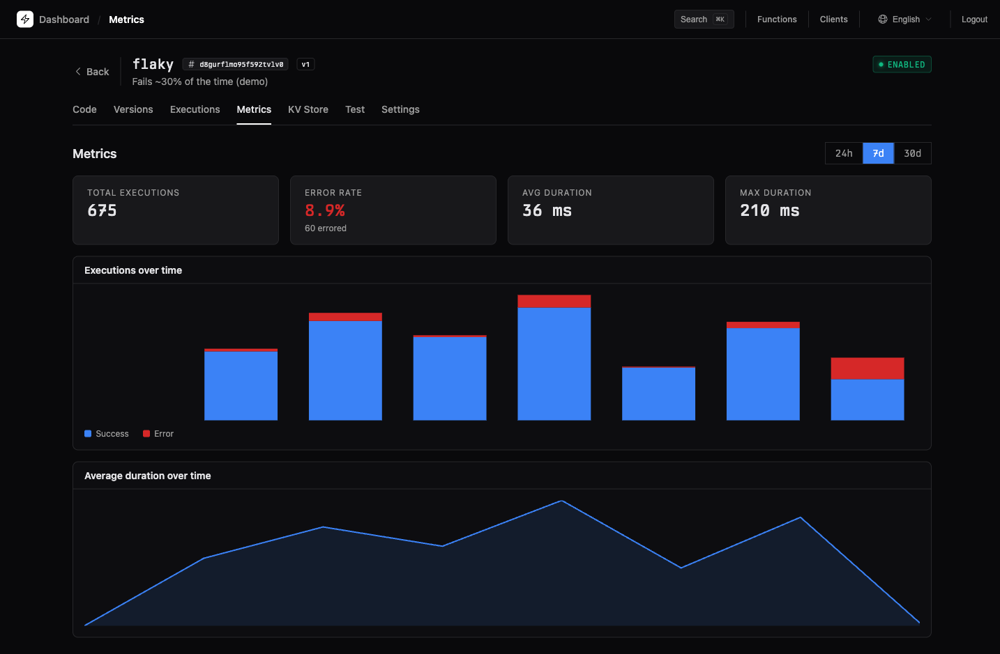
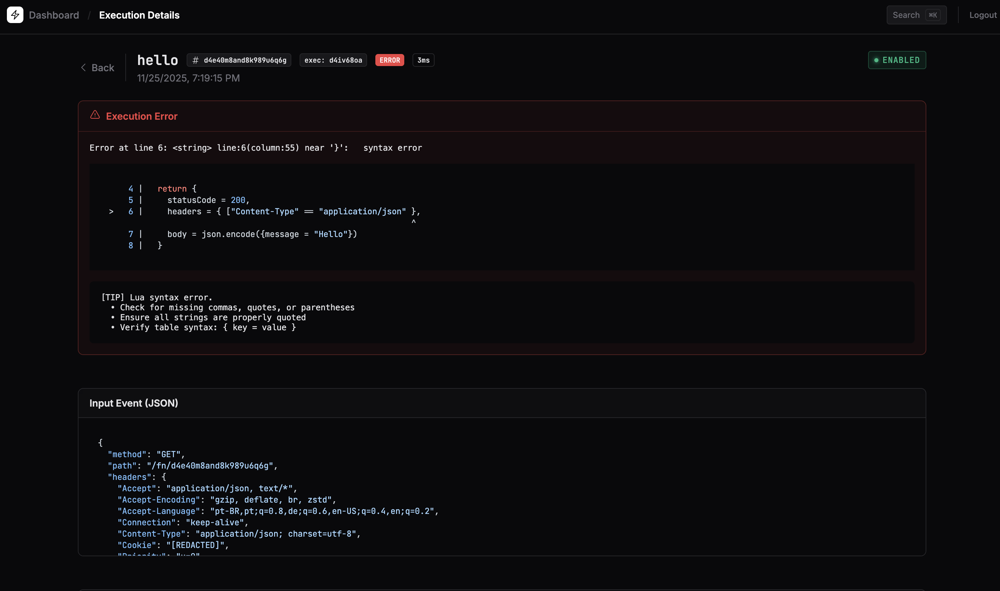
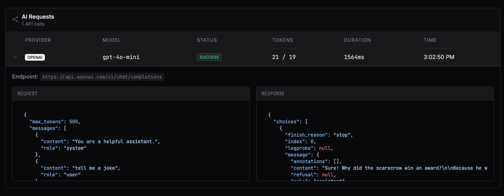
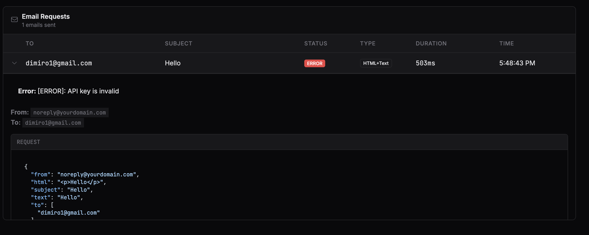

<p align="center">
  
</p>

# Lunar (formerly Faas-Go)

[](https://pkg.go.dev/github.com/dimiro1/lunar)
[](https://goreportcard.com/report/github.com/dimiro1/lunar)

A lightweight, self-hosted Function-as-a-Service platform written in Go with Lua and Starlark scripting.

> **Beta Phase Notice**: This project is currently in beta. New features and changes are actively being developed, but I promise to maintain backward compatibility for all Lua and Starlark APIs. 

## Features

* **Lua & Starlark Functions** - Write serverless functions in Lua or Starlark (a sandboxed Python dialect)
* **Code Editor** - Monaco Editor with autocomplete and inline documentation
* **HTTP Triggers** - Execute functions via HTTP requests
* **Built-in APIs** - HTTP client, KV store, environment variables, logging, and more
* **AI Integration** - Chat completions with OpenAI and Anthropic, with request/response logging
* **Email Integration** - Send emails via Resend with scheduling support
* **Version Control** - Track and manage function versions
* **Execution History** - Monitor function executions and logs
* **Metrics Dashboard** - Per-function execution count, error rate, and average/max duration, trended over time
* **Beautiful Error Messages** - Human-friendly error messages with code context, line numbers, and actionable suggestions
* **Web Dashboard** - Manage functions through a clean web interface
* **GraphQL API** - Typed, introspectable management API with a GraphiQL playground at `/graphql`
* **Lightweight** - Single binary, no external dependencies

## Screenshots

### Dashboard


### Function Editor


### Environment Variables


### Testing Functions


### Execution History


### Function Metrics


### Version Management


### Version Comparison


### Command Palette


### Error Messages


### AI Request Logs


### Email Request Logs


## Quick Start

### Prerequisites

- [mise](https://mise.jdx.dev/) — manages the toolchain (Go, golangci-lint, deno, air, goreleaser) and runs project tasks
- Chrome or Chromium if you plan to run the E2E test suite

Run `mise tasks` to see every available task. For CLI internals and code generation details, see [cli/README.md](cli/README.md).

### Building from Source

```bash
git clone https://github.com/dimiro1/lunar.git
cd lunar
mise install   # fetch the pinned tool versions
mise run build
```

### Running

```bash
./build/lunar
```

For local development with live reload (`air` is provided by mise — no extra install step):

```bash
mise run dev
```

The application will be available at `http://localhost:3000`.

### First-Time Setup

On first run, Lunar will automatically generate an API key and save it to `data/api_key.txt`. The key will be printed in the server logs:

```
INFO Generated new API key key=cf31cb0cdc7811ca9cec6a3c77579b3ea28c1e4e10d6fc1061ae71788834c21b file=data/api_key.txt
```

When you access the dashboard, you'll be prompted to enter this API key to login. The key is also available in the `data/api_key.txt` file.

### Your First Function

1. Open `http://localhost:3000` and log in with the API key from `data/api_key.txt`.
2. Create a new function named `hello-world`.
3. Paste the sample handler below and save it.
4. Copy the function ID and invoke it:

```bash
curl http://localhost:3000/fn/<function-id>
```

You should get back a JSON response. After that, open the function's execution history in the dashboard to inspect logs and request details.

## Writing Functions

Functions can be written in **Lua** or **Starlark** (a deterministic, sandboxed
dialect of Python). A function's language is chosen when it is created and stays
fixed for its lifetime — both languages expose the same set of built-in APIs.
Every function must define a `handler` function.

### Lua

```lua
function handler(ctx, event)
  -- ctx contains execution context (executionId, functionId, etc.)
  -- event contains HTTP request data (method, path, query, body, headers)
  
  log.info("Function started")
  
  return {
    statusCode = 200,
    headers = { ["Content-Type"] = "application/json" },
    body = json.encode({ message = "Hello, World!" })
  }
end
```

### Starlark

```python
def handler(ctx, event):
    # ctx contains execution context (executionId, functionId, etc.)
    # event contains HTTP request data (method, path, query, body, headers)

    log.info("Function started")

    return {
        "statusCode": 200,
        "headers": {"Content-Type": "application/json"},
        "body": json.encode({"message": "Hello, World!"}),
    }
```

> Starlark is **not** full Python: there is no `while` loop, no recursion, no
> classes, no exceptions, and no Python standard library. Use the built-in
> modules below for I/O and helpers.

### Available APIs

* **log** - Logging utilities (info, debug, warn, error)
* **kv** - Key-value storage (get, set, delete)
* **env** - Environment variables (get)
* **http** - HTTP client (get, post, put, delete)
* **json** - JSON encoding/decoding
* **crypto** - Cryptographic functions (md5, sha256, hmac, uuid)
* **time** - Time utilities (now, format, sleep)
* **url** - URL utilities (parse, encode, decode)
* **strings** - String manipulation
* **random** - Random generators
* **base64** - Base64 encoding/decoding
* **ai** - AI chat completions (OpenAI, Anthropic)
* **email** - Send emails via Resend

### LLM-Assisted Development

Lunar provides an [`llms.txt`](https://llmstxt.org/) file at `/llms.txt` with the complete Lua and Starlark API reference, including function signatures, parameters, and code examples. You can use this with any LLM-powered coding assistant to get accurate help when writing Lunar functions.

### Example: Counter Function

```lua
function handler(ctx, event)
  -- Get current count from KV store
  local count = kv.get("counter") or "0"
  local newCount = tonumber(count) + 1
  
  -- Save updated count
  kv.set("counter", tostring(newCount))
  
  log.info("Counter incremented to: " .. newCount)
  
  return {
    statusCode = 200,
    headers = { ["Content-Type"] = "application/json" },
    body = json.encode({ count = newCount })
  }
end
```

### Example: Send Email

```lua
-- Requires RESEND_API_KEY environment variable
function handler(ctx, event)
  local data = json.decode(event.body)

  local result, err = email.send({
    from = "noreply@yourdomain.com",
    to = data.email,
    subject = "Welcome!",
    html = "<h1>Hello, " .. data.name .. "!</h1>",
    scheduled_at = time.now() + 3600  -- Optional: send in 1 hour
  })

  if err then
    return {
      statusCode = 500,
      body = json.encode({ error = err })
    }
  end

  return {
    statusCode = 200,
    headers = { ["Content-Type"] = "application/json" },
    body = json.encode({ email_id = result.id })
  }
end
```

### Calling Functions

```bash
curl -X GET http://localhost:3000/fn/{function-id}
curl -X POST http://localhost:3000/fn/{function-id} -d '{"key":"value"}'
curl -X GET http://localhost:3000/fn/{function-id}?name=John
```

## Deployment

### Docker

```bash
# Run the latest release from Docker Hub
docker run -p 3000:3000 -v $(pwd)/data:/data dimiro1/lunar:latest

# Build and run with Docker
docker build -t lunar .
docker run -p 3000:3000 -v lunar-data:/app/data lunar

# Or use Docker Compose
docker compose up -d
```

### Railway

Lunar is ready to deploy on [Railway](https://railway.app):

1. **Connect Repository** - Link your GitHub repository to Railway
2. **Add Volume** - Create a volume and mount it to `/data`
3. **Set Environment Variables**:
   - `BASE_URL` - Your Railway public URL (e.g., `https://yourapp.up.railway.app`)
   - `API_KEY` - (Optional) Set a custom API key, or let it auto-generate
4. **Deploy** - Railway will automatically detect the Dockerfile and deploy

The Dockerfile is Railway-compatible and will:
- Use Railway's automatic `PORT` environment variable
- Bind to `0.0.0.0:$PORT` for public networking
- Persist data to the mounted volume at `/data`

## Configuration

Lunar can be configured via environment variables:

```bash
PORT=3000                 # HTTP server port (default: 3000)
DATA_DIR=./data           # Data directory for SQLite database (default: ./data)
EXECUTION_TIMEOUT=300     # Function execution timeout in seconds (default: 300)
API_KEY=your-key-here     # API key for authentication (auto-generated if not set)
BASE_URL=http://localhost:3000  # Base URL for the deployment (auto-detected if not set)
METRICS_RETENTION_DAYS=365  # How long aggregated function metrics are kept (default: 365)
```

### Authentication

The dashboard requires authentication via API key. You can:

1. **Auto-generate** (recommended) - Let Lunar generate a secure key on first run
2. **Set manually** - Provide your own key via the `API_KEY` environment variable

The management API is served over **GraphQL** at `/graphql` (with a GraphiQL
playground in the browser). Requests authenticate using either:
- **Cookie** - Automatically handled by the dashboard after login
- **Bearer token** - Include `Authorization: Bearer YOUR_API_KEY` header

Example GraphQL call with a Bearer token:
```bash
curl -H "Authorization: Bearer YOUR_API_KEY" \
  -H "Content-Type: application/json" \
  -d '{"query":"{ functions(limit: 20, offset: 0) { nodes { id name } } }"}' \
  http://localhost:3000/graphql
```

Note: Function execution endpoints (`/fn/{id}`) do not require authentication.

The handful of endpoints that stay REST — cookie login/logout, the CLI device
authorization flow, and function execution — are documented in
[`docs/rest-endpoints.md`](docs/rest-endpoints.md).

## CLI

Lunar ships a command-line client (`lunar-cli`) built on the server's GraphQL API, so it always stays in sync with the schema.

### Installation

```bash
go install github.com/dimiro1/lunar/lunar-cli@latest
```

Or download a pre-built binary from the [Releases](https://github.com/dimiro1/lunar/releases) page (`lunar-cli_*` archives).

### AI Agent Skills

AI agent skills require the CLI to be installed first.

Lunar ships built-in skill definitions that teach your AI coding agent how to use the CLI and write Lua functions.

```bash
lunar-cli skills list             # show available skills
lunar-cli skills show lunar-cli       # CLI command reference
lunar-cli skills show lunar-lua       # Lua function authoring guide
lunar-cli skills show lunar-starlark  # Starlark function authoring guide
```

To install them, ask your agent:

> "Install the Lunar skills from the `lunar-cli skills` command."

### Authentication

```bash
# Start the device authorization flow (opens a browser tab for approval)
lunar-cli --server http://your-lunar-server login

# If the browser does not open automatically, use the printed approval URL and code.

# The token is saved to ~/.config/lunar/config.yaml automatically
# To log out and clear the stored token:
lunar-cli logout
```

You can also skip the login flow and pass a token directly:

```bash
lunar-cli --token YOUR_API_KEY functions list

# Or via environment variable:
export LUNAR_SERVER=http://your-lunar-server
export LUNAR_TOKEN=YOUR_API_KEY
lunar-cli functions list
```

### Configuration

The CLI stores its configuration in `~/.config/lunar/config.yaml`:

```yaml
server: http://localhost:3000
token: <your-api-token>
```

Flags and environment variables always take precedence over the config file:

| Priority | Source |
|----------|--------|
| 1 (highest) | `--server` / `--token` flags |
| 2 | `LUNAR_SERVER` / `LUNAR_TOKEN` env vars |
| 3 | `~/.config/lunar/config.yaml` |

### Commands

#### Functions

```bash
lunar-cli functions list [--limit 20] [--offset 0]
lunar-cli functions create --name hello-world --code handler.lua
lunar-cli functions create --name hello-world --code handler.star --language starlark
lunar-cli functions create --name hello-world --code -  # read code from stdin
lunar-cli functions get <id>
lunar-cli functions update <id> --name new-name
lunar-cli functions update <id> --cron-schedule "*/5 * * * *" --cron-status active
lunar-cli functions update <id> --disabled
lunar-cli functions delete <id>
lunar-cli functions env <id> --env API_KEY=secret --env DEBUG=true
lunar-cli functions kv <id> --kv counter=0 --kv state=idle
lunar-cli functions kv <id> --kv shared=value --global   # write to global KV
lunar-cli functions next-run <id>
```

#### Versions

```bash
lunar-cli versions list <function-id>
lunar-cli versions get <function-id> <version-number>
lunar-cli versions activate <function-id> <version-id>
lunar-cli versions delete <function-id> <version-id>
lunar-cli versions diff <function-id> <v1> <v2>
```

#### Executions

```bash
lunar-cli executions list <function-id>
lunar-cli executions get <execution-id>
lunar-cli executions logs <execution-id>
lunar-cli executions ai-requests <execution-id>
lunar-cli executions email-requests <execution-id>
```

#### API Tokens

```bash
lunar-cli tokens list
lunar-cli tokens revoke <token-id>
```

#### LLM Reference

```bash
lunar-cli llms
```

#### Invoke

Execute a function directly without authentication (functions are public by default):

```bash
lunar-cli invoke <function-id>
lunar-cli invoke <function-id> --method POST --body '{"key":"value"}'
lunar-cli invoke <function-id> --method POST --body -   # read body from stdin
```

### Keeping the CLI in Sync with the API

The CLI talks to the server's GraphQL API (`/graphql`) using a thin
[hasura/go-graphql-client](https://github.com/hasura/go-graphql-client) wrapper.
The GraphQL schema is the single source of truth: the server won't compile until
every field has a resolver, and the CLI's queries are checked against the live
schema by introspection. After changing a command, rebuild with:

```bash
mise run build-cli
```

## Testing

### Go Tests

Run the Go unit tests:

```bash
mise run test
```

### Frontend Tests (Jasmine)

The frontend uses [Jasmine](https://jasmine.github.io/) for unit testing, running directly in the browser without Node.js dependencies.

```bash
mise run test-frontend
```

This starts a local Go server and opens the test runner at `http://localhost:8888/test/SpecRunner.html`. Tests cover:

- Route URL generators
- UI components (Button, Badge, Table, Pagination, ...)

### E2E Tests (Cucumber + chromedp)

End-to-end tests are written as [Cucumber](https://cucumber.io/) feature files
and run with [godog](https://github.com/cucumber/godog). Each scenario drives the
real dashboard in a headless Chrome browser (via
[chromedp](https://github.com/chromedp/chromedp)) against an in-process server —
true black-box testing through the UI a user actually sees. The only thing done
outside the browser is invoking a deployed function, which is a public HTTP
endpoint a real client would call directly.

The feature files in `e2e/features/` read like a product spec (no selectors, no
implementation detail); the step definitions in `e2e/*_test.go` translate that
intent into browser interactions.

Make sure Chrome or Chromium is installed before running them.

```bash
mise run test-e2e
# Run a single feature while iterating:
GODOG_FEATURE=e2e/features/sign_in.feature go test ./e2e/
```

E2E scenarios cover:

- Signing in and out of the dashboard
- Creating, listing, renaming, and deleting functions
- Invoking functions over HTTP (Lua, Starlark, templates, methods, env vars)
- Editing code, version history, rollback, and version comparison
- Execution history and disabled/deleted-function behaviour
- The key-value store and cron scheduling
- The connected clients page

### Run All Tests

```bash
mise run test-all
```

This runs Go unit tests and E2E tests. Run `mise run test-frontend` separately to open the browser-based Jasmine tests.

## Architecture

* **Backend** - Go with standard library HTTP server, SQLite database
* **Frontend** - Mithril.js SPA with Monaco Editor
* **Runtime** - GopherLua for Lua and starlark-go for Starlark script execution
* **Storage** - SQLite for functions, versions, executions, KV store, and environment variables

### Frontend Dependencies

JavaScript dependencies are vendored in `frontend/vendor/` (no npm required). Versions are managed in `mise.toml`:

| Library | Purpose |
|---------|---------|
| Mithril.js | SPA framework |
| Monaco Editor | Code editor |
| Highlight.js | Syntax highlighting |
| Jasmine | Frontend testing |

To update dependencies, edit the version variables in `mise.toml` and run:

```bash
mise run vendor-js
```

## Contributing

Contributions are welcome! Please feel free to submit issues or pull requests.

## Author

Claudemiro Alves Feitosa Neto

## License

MIT License - see [LICENSE](LICENSE) file for details.
